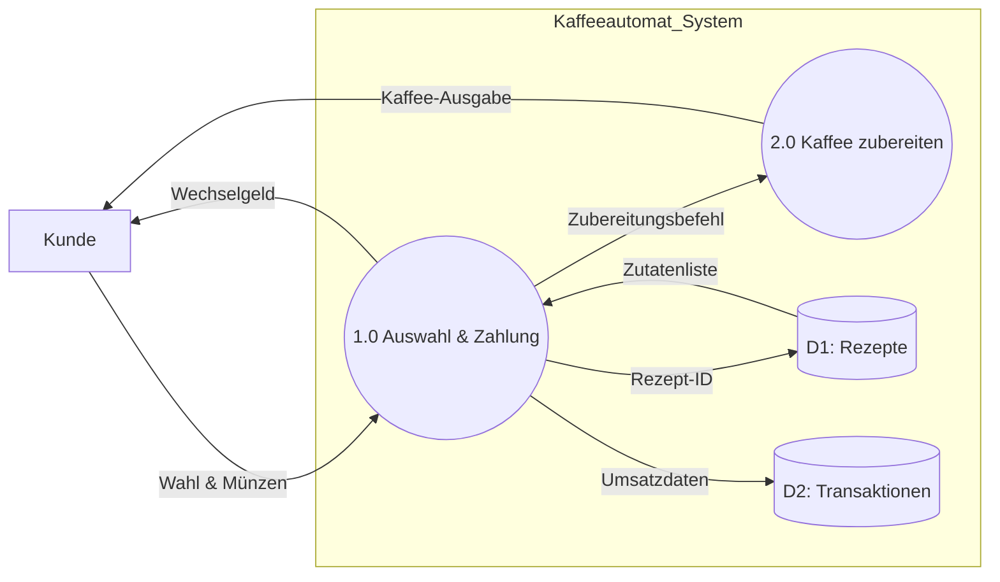

# Systemmodellierung und UML im Security-Kontext

In der Systemanalyse helfen konzeptuelle Modelle (UML), die Systemfunktionen aus Nutzersicht darzustellen und die Grenzen des Systems exakt zu definieren.

## 1. System- und Kontextabgrenzung
* **Systemgrenze:** Trennt das zu entwickelnde System von seiner Umgebung (Was gehört zum System, was wird extern gelöst?).
* **Systemkontext:** Der Teil der Umgebung, der für die Definition und das Verständnis der Anforderungen relevant ist (z. B. externe Bezahlsysteme).
* **Kontextgrenze:** Trennt den relevanten Kontext von der völlig irrelevanten Umgebung.
* **Die Grauzone:** Da Systemschnittstellen zu Beginn des RE-Prozesses selten präzise definiert sind, existiert anfangs eine vage Trennung an den Grenzen, die schrittweise eliminiert werden muss.

## 2. UML Use Case Diagramme (UCD)
Use Case Diagramme beschreiben das "Was" (Interaktion) und den "Zweck" (Ziel) eines Systems aus der Perspektive des Endnutzers, ignorieren jedoch jegliche technische Implementierungsdetails.

### Die 4 Hauptelemente eines UCD:
* **Akteure (Actors):** Personen, Rollen oder externe Systeme/Geräte, die mit dem System interagieren.
* **Systemgrenze (Boundary):** Der Rahmen des betrachteten Systems.
* **Use Cases:** Die Dienste oder Prozesse, die das System ausführt (Ellipsen).
* **Beziehungen:** Linien zwischen Akteuren und Use Cases.
  * `<<include>>`: Zeigt an, dass ein Use Case zwingend das Verhalten eines anderen benötigt.
  * `<<extend>>`: Beschreibt optionales Verhalten, das nur unter bestimmten Bedingungen ausgeführt wird.

## 3. Praxisbeispiel: Use Case Spezifikation (Kaffeeautomat)

### UC-1: Kaffee beziehen
* **Actor:** Kunde
* **Trigger:** Nutzer drückt die Wahltaste für ein Produkt.
* **Ablauf:** Der Nutzer wählt ein Getränk aus, bezahlt den fälligen Betrag über ein Interface und das System gibt das gewählte Heissgetränk aus.
* **Success Guarantee:** Das gewählte Getränk wurde korrekt zubereitet und ausgegeben; der korrekte Betrag wurde abgebucht.

### UC-2: Zutaten nachfüllen
* **Actor:** Wartungstechniker
* **Trigger:** Automatische Füllstandswarnung des Systems oder turnusmässig geplante Wartung.
* **Ablauf:** Der Techniker öffnet das Gehäuse, füllt Kaffeebohnen, Milchpulver oder Wasser nach und setzt die Füllstandssensoren manuell zurück.
* **Success Guarantee:** Alle Vorratsbehälter sind vollständig gefüllt und das System befindet sich wieder im Status "Betriebsbereit".

### UC-3: Systemreinigung durchführen
* **Actor:** Servicepersonal / Unterhaltsteam
* **Trigger:** Erreichen einer vordefinierten Anzahl an Bezügen oder manuelle Aktivierung.
* **Ablauf:** Das System führt einen softwaregesteuerten Reinigungszyklus durch (Spülen der Leitungen, Reinigung der Brühgruppe, Entkalkung).
* **Success Guarantee:** Alle Rückstände sind entfernt, die strengen Hygienevorgaben sind erfüllt und der Zähler für das Reinigungsintervall ist zurückgesetzt.

## 4. Security Engineering: Misuse & Mitigation Cases
Cybersecurity beginnt bereits in der Analysephase. Klassische Use-Case-Diagramme werden hierfür gezielt erweitert:
* **Misuse Cases:** Beschreiben böswillige Handlungen eines Angreifers (z. B. Identitätsdiebstahl, Injection-Angriffe), welche die Schutzziele des Systems bedrohen.
* **Mitigation Cases:** Funktionen, die im System implementiert werden, um die durch den Misuse Case beschriebene Bedrohung aktiv zu mindern oder zu eliminieren (z. B. eine strikte Input-Validierung).

## 5. Datenflussdiagramme (DFD) & Schnittstellen-Sicherheit
Während Use Cases die Akteurssicht zeigen, fokussieren sich DFDs auf die Transformation von Input zu Output durch Prozesse und Datenspeicher. 

### DFD-Modellierung des Kaffeeautomaten:

### Die goldene Regel der DFDs:
Daten fliessen niemals "magisch" von einem Speicher zum anderen; sie müssen immer zwingend durch einen aktiven Prozess laufen.

### Trust Boundaries (Vertrauensgrenzen):
Übergänge zwischen verschiedenen Netzwerken oder unterschiedlichen Privilegienstufen (z. B. Eingabe vom Kunden an das interne Bezahlsystem) stellen **Trust Boundaries** dar. Sie sind die primären Angriffspunkte. Wenn Sender und Empfänger Daten an diesen Schnittstellen unterschiedlich interpretieren, entstehen kritische Sicherheitslücken. Strenge **Input Validation** an jeder Vertrauensgrenze ist die wichtigste Verteidigungsmassnahme.

Verknüpftes Thema: [[04_Threat_Modeling]] (Analyse von DFDs mittels STRIDE).