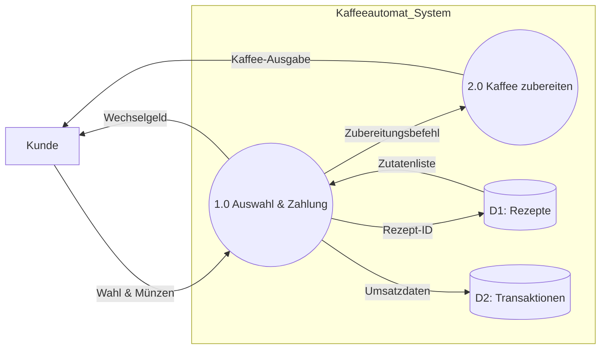

### UC-1: Kaffee beziehen
| Feld                   | Beschreibung                                                                                                     |
| :--------------------- | :--------------------------------------------------------------------------------------------------------------- |
| **Use Case Name**      | Kaffee beziehen                                                                                                  |
| **Use Cases**          | Der Nutzer wählt ein Getränk aus, bezahlt den fälligen Betrag und das System gibt das gewählte Heissgetränk aus. |
| **System**             | Kaffeeautomat                                                                                                    |
| **Actor**              | Kunde                                                                                                            |
| **Trigger**            | Nutzer drückt die Wahltaste für ein Produkt.                                                                     |
| **Success Guarantees** | Das gewählte Getränk wurde korrekt zubereitet und ausgegeben; der korrekte Betrag wurde abgebucht.               |

---

### UC-2: Zutaten nachfüllen
| Feld                   | Beschreibung                                                                                                                |
| :--------------------- | :-------------------------------------------------------------------------------------------------------------------------- |
| **Use Case Name**      | Zutaten nachfüllen                                                                                                          |
| **Use Cases**          | Der Techniker öffnet das Gehäuse, füllt Kaffeebohnen, Milchpulver oder Wasser nach und setzt die Füllstandssensoren zurück. |
| **System**             | Kaffeeautomat                                                                                                               |
| **Actor**              | Wartungstechniker                                                                                                           |
| **Trigger**            | Füllstandswarnung des Systems oder geplante Wartung.                                                                        |
| **Success Guarantees** | Alle Vorratsbehälter sind gefüllt und das System ist wieder im Status "Betriebsbereit".                                     |

---

### UC-3: Systemreinigung durchführen
| Feld | Beschreibung |
| :--- | :--- |
| **Use Case Name** | Systemreinigung durchführen |
| **Use Cases** | Das System führt einen geführten Reinigungszyklus durch. Dies beinhaltet das Spülen der Leitungen, die Reinigung der Brühgruppe und ggf. die Entkalkung. |
| **System** | Kaffeeautomat |
| **Actor** | Servicepersonal / Unterhaltsteam |
| **Trigger** | Erreichen einer vordefinierten Anzahl an Bezügen oder manuelle Aktivierung durch das Personal. |
| **Success Guarantees** | Alle Rückstände sind entfernt, die Hygienevorgaben sind erfüllt und der Zähler für den Reinigungsintervall wurde zurückgesetzt. |

# DFD

