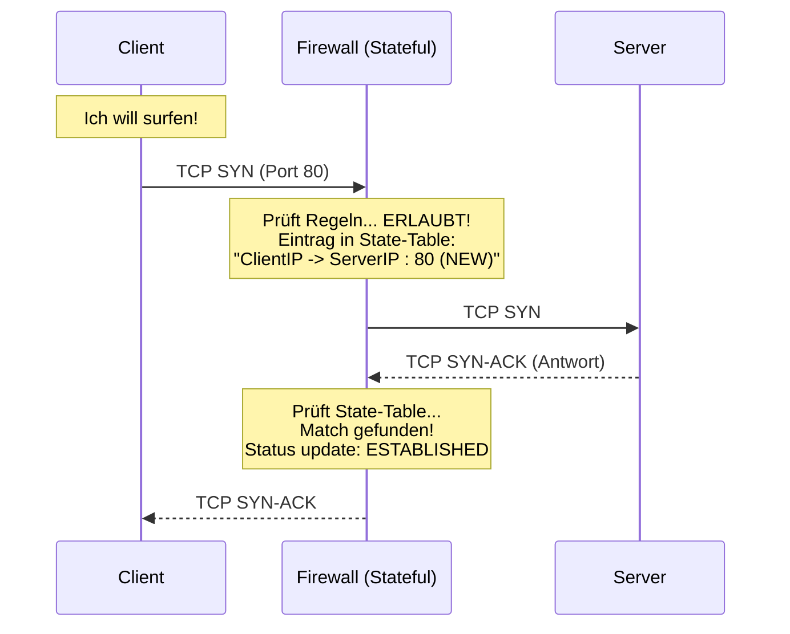

# 🔥 Firewall Grundlagen & Typen

> [!abstract] Definition
> Eine Firewall ist ein Sicherheits-System, das den ein- und ausgehenden Netzwerkverkehr basierend auf **definierten Sicherheitsregeln** überwacht und steuert.
> * **Standard-Verhalten:** "Implicit Deny" (Alles, was nicht erlaubt ist, ist verboten).
> * **Position:** Zwischen Zonen unterschiedlichen Vertrauens (z.B. LAN vs. Internet).

---

## 1. Die Evolution der Firewalls (Klausur-Tabelle)

Du musst die Generationen unterscheiden können.

| Typ | OSI Layer | Arbeitsweise | Merkmal |
| :--- | :--- | :--- | :--- |
| **Packet Filter** (Stateless) | 3 & 4 | Prüft jedes Paket isoliert. "Darf IP A zu IP B auf Port 80?" | Schnell, aber "dumm". Kennt keinen Zusammenhang. |
| **Stateful Inspection** (SPI) | 3 & 4 | Merkt sich den **Status** einer Verbindung (State Table). | Standard seit den 90ern. Erkennt Antwort-Pakete automatisch. |
| **Application Proxy** | 7 | Nimmt Paket an, packt es aus, prüft Inhalt, packt es neu ein. | Sehr sicher, aber langsam. Bricht Verbindung auf. |
| **NGFW** (Next-Generation) | 7 | Deep Packet Inspection (DPI). Erkennt Applikationen (Skype, Facebook) statt nur Ports. | Der heutige Standard (Palo Alto, Fortinet, Checkpoint). |

---

## 2. Stateless vs. Stateful (Der Unterschied)

Das ist die häufigste Prüfungsfrage in diesem Bereich.

### Stateless (Packet Filter) - "Der Vergessliche"
* Schaut sich Paket 1 an -> OK.
* Schaut sich Paket 2 an -> OK.
* **Problem:** Er weiß nicht, dass Paket 2 die Antwort auf Paket 1 ist.
* **Folge:** Man muss Regeln für **beide Richtungen** (Hin und Zurück) manuell öffnen. Sehr unsicher (Ports dauerhaft offen).

### Stateful Inspection (SPI) - "Das Elefantengedächtnis"
* Erstellt eine **State Table** (Zustandstabelle) im RAM.
* Wenn Client (Intern) eine Verbindung aufbaut (SYN), merkt sich die Firewall das.
* Wenn der Server (Extern) antwortet (SYN-ACK), schaut die Firewall in die Tabelle: "Gehört das zu einer bekannten Anfrage?" -> **JA** -> Durchlassen.
* **Vorteil:** Man braucht nur Regeln für die **hinausgehende** Richtung. Die Antwort wird *dynamisch* erlaubt.

---

## 3. Aktionen: Drop vs. Reject

Was passiert mit verbotenen Paketen?

| Aktion | Verhalten | Auswirkung beim Sender | Nutzung |
| :--- | :--- | :--- | :--- |
| **DROP** (Deny) | Paket wird **stumm verworfen**. Keine Rückmeldung. | Sender wartet bis zum Timeout (Sanduhr dreht sich). | **Sicherer!** Hacker weiß nicht, ob IP existiert oder gefiltert wird ("Stealth"). |
| **REJECT** | Paket wird verworfen, aber Firewall sendet **ICMP Unreachable** zurück. | Sender bekommt sofort Fehler: "Connection refused". | Gut zum Debuggen im LAN. Schlecht fürs Internet (verrät Infos). |

---

## 4. Rule Processing (Top-Down Prinzip)

Firewalls arbeiten Listen von oben nach unten ab.

1.  **First Match:** Die *erste* Regel, die zutrifft, gewinnt.
2.  **Order Matters:** Die Reihenfolge ist kritisch! Spezifische Regeln müssen vor allgemeinen Regeln stehen.
3.  **Implicit Deny:** Am Ende der Liste steht (oft unsichtbar) immer eine "Block All" Regel.

> [!danger] Das "Shadowing" Problem
> Falsche Reihenfolge:
> 1. `Allow Any -> Any`
> 2. `Block Client A -> Facebook`
>
> **Ergebnis:** Client A kann auf Facebook, weil Regel 1 schon "Ja" gesagt hat. Regel 2 wird nie erreicht (sie wird von Regel 1 "beschattet").

---

## 5. Host-based vs. Network-based

| Merkmal | Host-based FW | Network-based FW |
| :--- | :--- | :--- |
| **Beispiel** | Windows Defender Firewall, `iptables` (Linux). | Hardware Appliance (Cisco, Sophos), VM. |
| **Schutzbereich** | Schützt nur **ein** Gerät. | Schützt das **ganze Netzwerk**. |
| **Vorteil** | Kennt die lokale Software ("Darf Word ins Netz?"). Schützt auch im VPN/Homeoffice. | Zentrales Management. Entlastet die Clients. |
| **Nachteil** | Kann vom User/Malware deaktiviert werden. | Kann keinen Traffic *innerhalb* des gleichen LAN-Segments (Switch) sehen. |

---

## 6. Wichtige Begriffe für den Spicker

* **Ingress Filter:** Filterung von eingehendem Verkehr.
* **Egress Filter:** Filterung von ausgehendem Verkehr (wichtig gegen C&C Botnetze).
* **ACL (Access Control List):** Die Liste der Regeln.
* **Tuple:** Eine Regel besteht meist aus dem "5-Tuple":
    1.  Source IP
    2.  Source Port
    3.  Destination IP
    4.  Destination Port
    5.  Protocol (TCP/UDP)