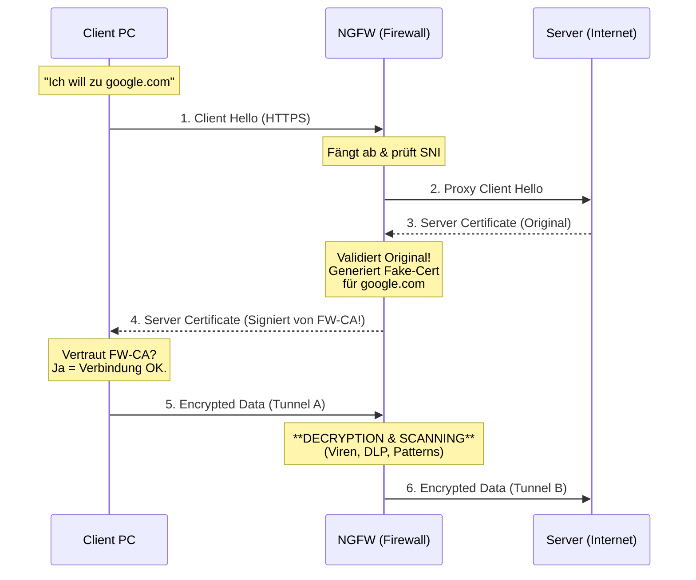

# 🕵️‍♀️ Layer 7 Firewalls & SSL Inspection (Deep Dive)

> [!abstract] Das Problem der Verschlüsselung
> Heute sind ca. 90% des Traffics via HTTPS (TLS) verschlüsselt.
> * **Klassische Firewall (L3/L4):** Sieht nur "Port 443" -> ist blind.
> * **Layer 7 Firewall (NGFW):** Muss den Traffic **aufbrechen** (entschlüsseln), um Viren, Data-Leaks oder Angriffe im Datenstrom zu finden.
> * **Technik:** Das nennt man **SSL/TLS Inspection** oder **SSL Proxying**.

---

## 1. Funktionsweise: Der "Legale" Man-in-the-Middle

Die Firewall schiebt sich physisch und logisch zwischen Client und Server. Sie terminiert die SSL-Verbindung des Clients und baut eine neue zum Server auf.

### Der Ablauf (Schritt-für-Schritt)

1.  **Client:** Startet Verbindung zu `bank.de` (Client Hello).
2.  **Firewall:** Fängt das Paket ab.
3.  **Firewall -> Server:** Baut Verbindung zu `bank.de` auf und prüft deren Zertifikat.
4.  **Firewall (Intern):**
    * Generiert "on the fly" ein **neues Zertifikat** für `bank.de`.
    * Signiert dieses Zertifikat mit ihrer **eigenen privaten CA** (Certificate Authority).
5.  **Firewall -> Client:** Sendet dem Client das **gefälschte** Zertifikat.
6.  **Ergebnis:**
    * Tunnel 1: Client <-> Firewall (verschlüsselt mit Fake-Cert).
    * **Klartext:** Auf der Firewall (hier wird gescannt!).
    * Tunnel 2: Firewall <-> Server (verschlüsselt mit Original-Cert).

---

## 2. Voraussetzung: Die PKI (Trust Chain)

Damit das funktioniert, ohne dass der Browser des Users rot blinkt ("Sicherheitswarnung!"), muss eine Vorbedingung erfüllt sein:

> [!danger] Das Root-Zertifikat
> Das **Root-Zertifikat der Firewall (CA)** muss auf **allen Client-PCs** im Speicher der "Vertrauenswürdigen Stammzertifizierungsstellen" installiert sein (meist per GPO / Gruppenrichtlinie ausgerollt).
>
> Ohne diesen Trust zeigt der Browser: `SEC_ERROR_UNKNOWN_ISSUER`.

---

## 3. Grenzen der Inspection (Bypass & Pinning)

Man kann (und darf) nicht alles entschlüsseln.

| Problem | Erklärung | Lösung |
| :--- | :--- | :--- |
| **Datenschutz (GDPR)** | Es ist oft illegal, Online-Banking oder Gesundheitsdaten von Mitarbeitern zu entschlüsseln (Mitlesen von Passwörtern!). | **Exception Policy:** Kategorie "Finance/Health" wird **nicht** entschlüsselt (Bypass). |
| **Certificate Pinning** | Apps (z.B. Dropbox, Banking-Apps, Windows Update) haben den Fingerabdruck des Original-Zertifikats fest einprogrammiert ("Hardcoded"). Sie erkennen das Fake-Zertifikat der Firewall sofort als Angriff und brechen ab. | **Do-Not-Decrypt List:** Diese Ziele müssen anhand der IP oder SNI vom Scanning ausgenommen werden. |
| **Performance** | SSL Entschlüsselung kostet extrem viel CPU-Leistung auf der Firewall (Durchsatz sinkt oft um 50-70%). | Hardware-Beschleunigung (ASICs) nutzen oder nur selektiv scannen. |

---

## 4. SNI (Server Name Indication)

Was macht die Firewall, wenn sie **nicht** entschlüsseln darf (z.B. Banking), aber trotzdem wissen will, wo der User hinsurft (URL-Filter)?

Sie nutzt **SNI**.

* **Was ist das?** Eine Erweiterung des TLS-Handshakes.
* **Der Trick:** Im allerersten Paket (`Client Hello`) sendet der Client den Namen des Zielservers (`sparkasse.de`) im **Klartext**, *bevor* die Verschlüsselung ausgehandelt ist.
* **Limitation:** Die Firewall sieht nur den Hostname (`facebook.com`), aber **nicht** den Pfad/Inhalt (`facebook.com/messerstecherei_video`).

> [!info] Zukunftsmusik: ECH (Encrypted Client Hello)
> Der neue Standard TLS 1.3 mit ECH (Encrypted Client Hello) verschlüsselt auch das SNI-Feld. Das wird Firewalls in Zukunft massiv blind machen ("Going Dark").

---

## 5. Layer 7 Schutzfunktionen (Was bringt das?)

Wenn die Firewall den Traffic entschlüsselt hat (DPI), kann sie folgende Analysen fahren:

1.  **IPS (Intrusion Prevention):** Sucht nach Angriffsmustern (Exploits) im Datenstrom (z.B. SQL-Injection in einem HTTP-Request).
2.  **Anti-Virus / Malware Sandbox:** Lädt Dateien (PDF, EXE) herunter, führt sie in einer sicheren Umgebung aus (Sandbox) und prüft, ob sie schädlich sind, bevor der User sie bekommt.
3.  **DLP (Data Loss Prevention):** Prüft ausgehenden Traffic auf sensible Daten (z.B. "Stehen Kreditkartennummern oder 'Vertraulich' im Dokument?").
4.  **File Type Blocking:** "Erlaube Download von PDF, aber blockiere EXE", auch wenn die EXE in `bericht.pdf` umbenannt wurde (Magic Bytes Prüfung).

---

## 6. Zusammenfassung Vergleichstabelle

| Feature | Ohne SSL Inspection | Mit SSL Inspection |
| :--- | :--- | :--- |
| **URL Filter** | Nur Domain (via SNI) | Komplette URL (inkl. Pfad/Suchbegriffe) |
| **Virenscan** | Nein (kann nicht in Datei schauen) | Ja (voller Scan) |
| **App Control** | Ungenau (Raten anhand Verhalten/Cert) | Exakt (Inhalt erkennbar) |
| **Data Leakage** | Nein | Ja |
| **Privatsphäre** | Hoch (Firewall sieht nichts) | Niedrig (Admin könnte theoretisch mitlesen) |
| **CPU Last** | Niedrig | Sehr Hoch |