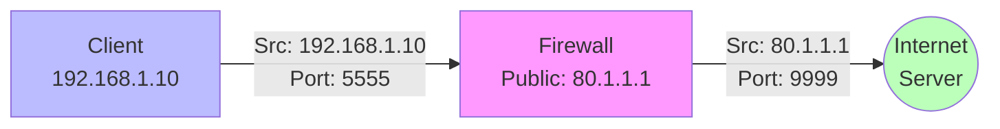
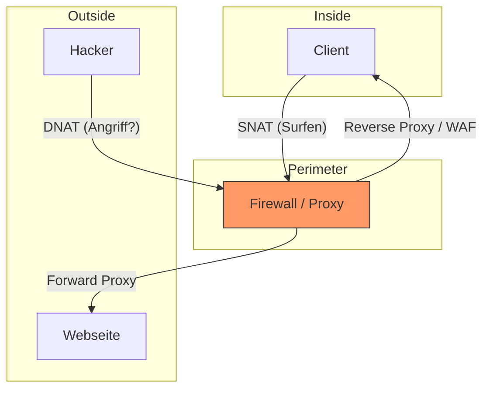

# 🔄 Firewall Services: NAT, DHCP, DNS & Proxy

> [!abstract] Überblick
> Eine moderne Firewall ist mehr als nur ein Türsteher (Filter). Sie ist oft auch:
> * **Übersetzer:** NAT (Adressen austauschen).
> * **Verteiler:** DHCP (IPs vergeben).
> * **Wegweiser:** DNS (Namen auflösen).
> * **Stellvertreter:** Proxy (Verbindungen übernehmen).

---

## 1. NAT (Network Address Translation)

Da IPv4-Adressen knapp sind und wir interne Netzwerke verstecken wollen, ist NAT zwingend nötig.

### Die große Unterscheidung (Klausur-Basiswissen)

| Typ | Richtung | Auch bekannt als... | Zweck |
| :--- | :--- | :--- | :--- |
| **SNAT** | **Raus** (LAN -> Internet) | Source NAT, Masquerading, PAT | Interne User surfen mit *einer* öffentlichen IP. |
| **DNAT** | **Rein** (Internet -> DMZ) | Destination NAT, Port Forwarding, VIP | Einen internen Webserver öffentlich erreichbar machen. |
| **1:1 NAT**| Beide | Static NAT, Binat | Exakte Zuordnung: 1 öffentliche IP = 1 private IP (selten). |

---

## 2. SNAT (Source NAT) / Masquerading

**Szenario:** 100 Mitarbeiter wollen surfen, aber die Firma hat nur 1 öffentliche IP (`80.1.1.1`).

* **Problem:** Das Internet kann private IPs (z.B. `192.168.1.50`) nicht routen.
* **Lösung:** Die Firewall tauscht die **Absender-Adresse** (Source) aus.
* **PAT (Port Address Translation):** Da viele auf eine IP kommen, nutzt die Firewall unterschiedliche **Source-Ports**, um die Rückantworten auseinanderzuhalten.

---

## 3. DNAT (Destination NAT) / Port Forwarding

**Szenario:** Ein Webserver steht in der DMZ (`10.0.0.5`), muss aber aus dem Internet erreichbar sein.

* **Problem:** Niemand im Internet kommt an die `10.0.0.5`.
* **Lösung:** Man ruft die öffentliche IP der Firewall auf. Die Firewall tauscht die **Ziel-Adresse** (Destination) aus.

**Ablauf:**
1.  Hacker Harry sendet an `80.1.1.1` (Firewall) auf Port 80.
2.  Firewall schaut in Regeltabelle: "Port 80 an 80.1.1.1 gehört zu 10.0.0.5".
3.  Firewall ändert Destination-IP auf `10.0.0.5` und leitet weiter.

> [!warning] Hairpinning (NAT Loopback)
> Wenn ein *interner* User den *externen* Namen (`www.firma.de` -> `80.1.1.1`) aufruft, muss die Firewall das Paket raus und direkt wieder rein leiten (Haarnadelkurve). Das muss oft extra aktiviert werden!

---

## 4. DHCP auf der Firewall

Oft fungiert die Firewall als DHCP-Server für kleine Netze oder Gäste-WLANs.

### Wichtige Konzepte
1.  **DHCP Server:** Die Firewall vergibt IPs, Gateway und DNS direkt.
2.  **DHCP Relay (IP Helper):**
    * In großen Netzen steht der DHCP-Server (Windows/Linux) zentral.
    * Broadcasts (`Discover`) kommen nicht über Router/Firewall-Grenzen.
    * **Relay Agent:** Die Firewall fängt den Broadcast im LAN ab, wandelt ihn in Unicast um und schickt ihn zum zentralen Server.

### Security: DHCP Snooping
* Verhindert **Rogue DHCP Server** (jemand steckt einen billigen Router an die Wanddose).
* Die Firewall/Switch lässt DHCP-Antworten (Offers) nur von vertrauenswürdigen Ports zu.

---

## 5. DNS & DNS-Security

Die Firewall ist meistens ein **DNS Forwarder (Proxy)**.
Client -> Firewall -> Google DNS (`8.8.8.8`).

### DNS Sinkhole (Modernes Feature!)
Ein extrem mächtiges Sicherheitsfeature.
1.  User fängt sich Malware ein.
2.  Malware will "nach Hause telefonieren" zu `evil-hacker.com`.
3.  Firewall prüft die DNS-Anfrage gegen eine Blacklist.
4.  **Treffer:** Die Firewall blockiert nicht einfach, sondern antwortet mit einer **Sinkhole-IP** (eine interne Fake-IP).
5.  Der Client versucht nun, diese Fake-IP zu kontaktieren -> Admin sieht im Log sofort, welcher PC infiziert ist!

---

## 6. Proxy (Stellvertreter)

Ein Proxy bricht die Verbindung auf (Layer 7).

### A. Forward Proxy (Standard Proxy)
* **Schützt:** Die **User** im LAN.
* **Standort:** Vor den Clients.
* **Funktion:** Filtert URL, cached Inhalte, scannt Viren.
* **Modi:**
    * **Explicit:** Muss im Browser eingetragen werden (`proxy:8080`).
    * **Transparent:** Firewall fängt Traffic auf Port 80/443 automatisch ab (User merkt nichts).

### B. Reverse Proxy (WAF)
* **Schützt:** Die **Server** (Webserver).
* **Standort:** Vor dem Webserver (aus Sicht des Internets).
* **Funktion:**
    * **SSL Offloading:** Entschlüsselt HTTPS, damit der Webserver weniger Last hat.
    * **Load Balancing:** Verteilt Anfragen auf Server A und Server B.
    * **WAF (Web Application Firewall):** Filtert SQL-Injections oder XSS-Angriffe, bevor sie den Server erreichen.

### Vergleichstabelle (Spicker)

| Feature             | Forward Proxy            | Reverse Proxy                      |
| :------------------ | :----------------------- | :--------------------------------- |
| **Schützt wen?**    | Client (Mitarbeiter)     | Server (Webshop)                   |
| **Typischer Zweck** | Content Filter, Caching  | Lastverteilung, Sicherheit (WAF)   |
| **Sichtbarkeit**    | Client kennt Proxy (oft) | Client denkt, Proxy sei der Server |
| **Richtung**        | LAN -> Internet          | Internet -> DMZ                    |

---

## 7. Zusammenfassung (Diagramm)

