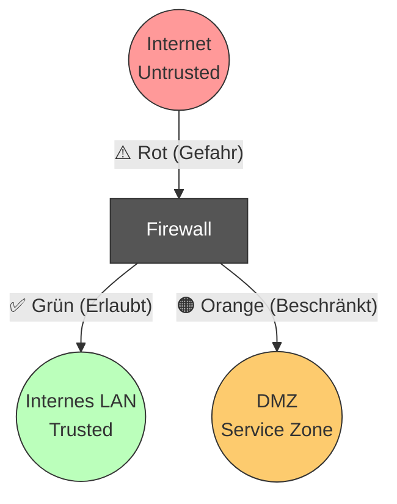

# 🔥 Firewalls, Zonen & DMZ - Prüfungsvorbereitung

> [!abstract] Grundprinzip
> Eine Firewall trennt Netzwerke unterschiedlicher Vertrauenswürdigkeit (**Trust Levels**).
> * **Inside (LAN):** Hohes Vertrauen.
> * **Outside (WAN/Internet):** Kein Vertrauen (Untrusted).
> * **DMZ (Demilitarized Zone):** Mittleres Vertrauen (Öffentliche Dienste).

---

## 1. Das Zonen-Modell (Visualisierung)

Das häufigste Prüfungsmodell ist die "3-Bein-Firewall" (Three-Legged Firewall).

---

## 2. Die Verkehrs-Matrix (Wer darf wohin?)

Das ist der **wichtigste Teil** für die Prüfung. Du musst wissen, welche Verbindung *initial* aufgebaut werden darf. (Antwortpakete erlaubt eine Stateful Firewall automatisch).

| Von (Quelle) | Nach (Ziel) | Aktion | Erklärung |
| :--- | :--- | :--- | :--- |
| **LAN** | **Internet** | ✅ **Allow** | Interne User surfen im Web (HTTP/HTTPS). |
| **LAN** | **DMZ** | ✅ **Allow** | Admins warten Server; User nutzen Intranet-Dienste. |
| **Internet** | **DMZ** | ✅ **Allow** | Externe greifen auf Webserver/Mailserver zu. (Oft eingeschränkt auf Ports 80/443). |
| **Internet** | **LAN** | ❌ **DENY** | **Niemals!** Das Internet darf nicht direkt auf Clients zugreifen. |
| **DMZ** | **Internet** | ✅ **Allow** | Server holen Updates oder leiten Mails weiter. |
| **DMZ** | **LAN** | ❌ **DENY** | **Kritisch!** Wenn ein Webserver in der DMZ gehackt wird, darf der Hacker nicht ins LAN kommen. |

> [!danger] Die Goldene Regel der DMZ
> Es darf **niemals** eine Verbindung *von* der DMZ *ins* LAN eröffnet werden.
> Sollte der Server in der DMZ Daten aus einer Datenbank im LAN brauchen, muss das LAN die Verbindung aufbauen (Pull) oder eine separate DB-Zone genutzt werden.

---

## 3. Was steht in der DMZ?

In die DMZ gehören alle Dienste, die aus dem Internet erreichbar sein **müssen**.

* **Webserver** (HTTP/HTTPS)
* **Mail-Gateways** (SMTP Relay)
* **DNS-Server** (Public DNS)
* **Proxy / Reverse Proxy**
* **FTP-Server**

**Was gehört NICHT in die DMZ:**
* Domain Controller (AD)
* Datenbank-Server (Kundendaten)
* Interne Fileserver

---

## 4. Firewall-Typen (OSI Layer)

| Typ | OSI Layer | Funktionsweise | Vorteil / Nachteil |
| :--- | :--- | :--- | :--- |
| **Packet Filter** | 3 & 4 | Schaut nur auf IP & Port. (Stateless). | 🚀 Schnell.   ⚠️ Unsicher, versteht keinen Zusammenhang. |
| **Stateful Inspection** | 4 | Merkt sich den **Verbindungsstatus** (State Table). Kennt "New", "Established". | ✅ Standard. Lässt Antwortpakete automatisch durch. |
| **Application Proxy** | 7 | Packt Daten komplett aus und analysiert den Inhalt (z.B. "Ist das wirklich HTTP?"). | 🛡️ Sehr sicher.   🐌 Langsam (CPU-intensiv). |
| **NGFW** (Next Gen) | 7 | Deep Packet Inspection (DPI), kann Apps erkennen (Facebook, YouTube) statt nur Ports. | ✅ State-of-the-Art. |

---

## 5. Regel-Verarbeitung (Processing)

Firewall-Regeln werden fast immer **Top-Down** (von oben nach unten) abgearbeitet.

1.  **First Match Wins:** Sobald eine Regel zutrifft (egal ob Allow oder Deny), wird gestoppt.
2.  **Implicit Deny:** Wenn keine Regel passt, wird am Ende alles verboten ("Alles was nicht explizit erlaubt ist, ist verboten").

> [!example] Beispiel Regelwerk
> 1. `Allow LAN -> Internet (HTTP)`
> 2. `Deny LAN -> Internet (Facebook-IP)`
> 3. `Deny Any -> Any` (Implizit)
>
> **Frage:** Kann User auf Facebook?
> **Antwort:** **JA**, weil Regel 1 zuerst matcht! (Typischer Konfigurationsfehler). Regel 2 müsste *vor* Regel 1 stehen.

---

## 6. NAT auf der Firewall

Da wir intern meist private IPs (RFC 1918) nutzen, muss die Firewall übersetzen.

### A. SNAT (Source NAT) / Masquerading
* **Richtung:** LAN -> Internet.
* **Zweck:** Viele interne PCs surfen über *eine* öffentliche IP.
* **Technik:** Die Firewall tauscht die *Absender*-IP gegen ihre eigene öffentliche IP aus (und merkt sich den Port).

### B. DNAT (Destination NAT) / Port Forwarding
* **Richtung:** Internet -> DMZ.
* **Zweck:** Webserver in der DMZ erreichbar machen.
* **Technik:** Jemand ruft die *öffentliche* IP der Firewall auf (z.B. Port 80). Die Firewall leitet das Paket an die *private* IP des Webservers in der DMZ weiter.

---

## 7. Architektur-Varianten

1.  **Bastion Host / 3-Legged:**
    * Eine Firewall mit 3 Netzwerkkarten (NICs).
    * Günstig, aber Single Point of Failure.
2.  **Sandwich (Back-to-Back):**
    * `Internet -- [FW 1] -- DMZ -- [FW 2] -- LAN`
    * **Vorteil:** Wenn FW 1 gehackt wird, ist das LAN immer noch durch FW 2 geschützt.
    * Oft nutzt man FW 1 und FW 2 von **unterschiedlichen Herstellern** (z.B. Cisco vorne, Checkpoint hinten), um Sicherheitslücken eines Herstellers nicht doppelt zu haben.