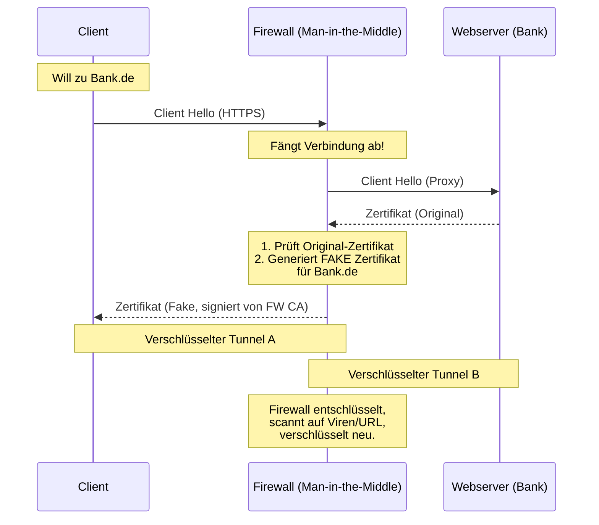

# 🛡️ Firewall: URL Filtering & Application Control (Layer 7)

> [!abstract] Das Problem: Port 80/443 ist alles
> Früher reichte es, Ports zu sperren.
> Heute laufen **Facebook, Teams, Malware und Windows Updates** alle über Port 443 (HTTPS).
> Eine klassische Packet-Filter-Firewall sieht nur: `TCP Port 443 Allow`.
> Eine **NGFW (Layer 7)** schaut *in* das Paket (Deep Packet Inspection).

---

## 1. URL Filtering (Web-Filter)

Hier wird der Zugriff basierend auf der **Webadresse (URL)** gesteuert, nicht auf der IP-Adresse.

### Funktionsweise
1.  **Blacklist / Whitelist:** Statische Listen (z.B. "Erlaube `firma.de`, blockiere `evil.com`").
2.  **Kategorie-Filter (Datenbank):** Die Firewall lädt täglich Updates von Herstellern (Cisco Talos, Palo Alto, etc.).
    * User ruft `www.bet365.com` auf.
    * Firewall prüft Kategorie -> "Gambling".
    * Regel: "Block Gambling" -> Zugriff verweigert.
3.  **Reputation Filter:** Webseiten bekommen einen "Score". Neue, unbekannte Domains sind oft automatisch "verdächtig".

> [!warning] URL vs. IP (Klausurfalle)
> Warum IP-Blocking nicht reicht:
> * **Virtual Hosts:** Auf einer IP (z.B. Cloudflare CDN) können tausende Webseiten liegen. Blockst du die IP, blockst du alle.
> * **Dynamische IPs:** Große Seiten (Google/Facebook) ändern ihre IPs ständig.
> * URL Filtering arbeitet auf **Layer 7** (HTTP Header / Host Feld).

---

## 2. Application Filtering (App Control)

Das Herzstück einer NGFW. Sie erkennt die **Anwendung**, egal welchen Port sie benutzt.

> [!example] Beispiel: SSH auf Port 80
> Ein schlauer Admin lässt seinen SSH-Server zuhause auf Port 80 laufen, um durch die Firewall zu kommen.
> * **Alte Firewall:** Sieht "Port 80" -> Denkt "Websurfen" -> **Erlaubt**.
> * **App Control:** Schaut in den Payload -> Sieht SSH-Handshake -> Erkennt "SSH Application" -> **Blockiert** (wenn SSH verboten ist).

### Granularität (Micro-Apps)
Moderne Firewalls können Anwendungen zerlegen:
* `Facebook Base` -> **Allow** (Chatten erlaubt).
* `Facebook Games` -> **Block** (Farmville verboten).
* `Facebook Video` -> **Throttle** (Bandbreite begrenzen).

**Erkennungsmethoden:**
* **Signaturen:** Bestimmte Byte-Muster im Datenstrom.
* **Verhalten (Heuristik):** Wie verhält sich der Traffic? (z.B. Skype baut Verbindung anders auf als HTTPS).

---

## 3. Deep Packet Inspection (DPI) & SSL/TLS

Da heute 90% des Traffics verschlüsselt ist (HTTPS), sieht die Firewall ohne Hilfe nur "Datensalat". URL-Filter und App-Control wären blind.

**Die Lösung: SSL Inspection (SSL Decryption)**

> [!danger] Wichtig für die Prüfung: Datenschutz & Limits
> SSL Inspection bricht die Ende-zu-Ende Verschlüsselung auf (legaler Man-in-the-Middle).
> * **Problem:** Die Firewall kann theoretisch Passwörter und Bankdaten lesen.
> * **Lösung:** Bestimmte Kategorien (Banking, Health, Government) werden per Policy **vom SSL-Scanning ausgenommen** (Bypass). Dort greift dann nur URL-Filtering (basierend auf dem Zertifikatsnamen/SNI), aber kein Virenscan im Payload.
> * **Voraussetzung:** Das CA-Zertifikat der Firewall muss auf allen Client-PCs installiert sein, sonst gibt es Browser-Warnungen ("Verbindung nicht sicher").

---

## 4. Vergleichstabelle (Der Spicker)

| Feature | OSI Layer | Was wird geprüft? | Stärke | Schwäche |
| :--- | :--- | :--- | :--- | :--- |
| **Packet Filter** | 3 & 4 | IP, Port, Protokoll | Sehr schnell, billig. | Blind für Inhalte. Port 80 = Alles erlaubt. |
| **URL Filter** | 7 | HTTP Host, URL Pfad | Verhindert Zugriff auf "böse" Seiten. | Wirkt oft nur bei Web-Traffic. |
| **App Control** | 7 | Payload-Signaturen | Erkennt App *unabhängig* vom Port. | Rechenintensiv (bremst Durchsatz). |
| **Content Filter**| 7 | Dateiinhalte (PDF, Exe) | Findet Keywords ("Geheim") oder Viren. | Braucht SSL-Decryption. |

---

## 5. Proxy vs. Firewall (Architektur)

Oft wird gefragt, wo der Unterschied liegt.

* **Transparent Firewall (NGFW):**
    * Client merkt nichts.
    * Client sendet an Gateway-IP.
    * Firewall inspiziert "im Vorbeigehen".

* **Web Proxy (Explicit):**
    * Muss im Browser eingetragen werden (z.B. `proxy.firma.local:8080`).
    * Protokollbruch: Client baut Verbindung zum Proxy auf, Proxy baut Verbindung zum Server auf.
    * Kann oft besseres Caching und detailliertere User-Authentifizierung (wer surft wann?).

---

## 6. SNI (Server Name Indication)

Wenn SSL Inspection **nicht** aktiviert ist, wie kann die Firewall dann HTTPS-URLs filtern?

* **Antwort:** Sie nutzt das **SNI-Feld** im `Client Hello` (Start des TLS Handshakes).
* **Das Feld:** Der Client sagt unverschlüsselt: "Ich möchte mit `www.youtube.com` reden", *bevor* die Verschlüsselung startet.
* **Limit:** Die Firewall sieht nur die Domain (`youtube.com`), aber nicht den genauen Pfad (`/watch?v=xyz`). Für den Pfad ist SSL-Decryption nötig.