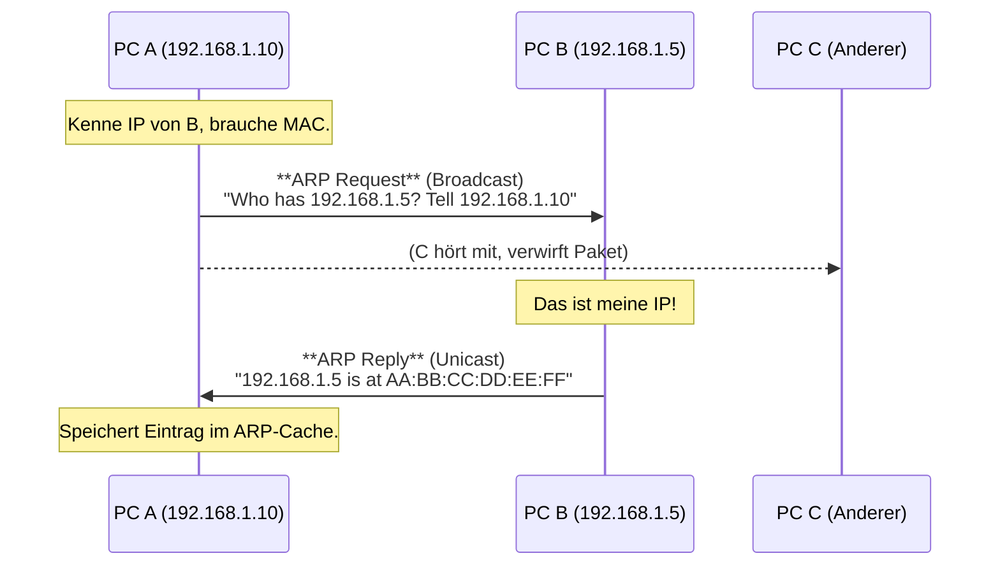

# 📡 IPv4 Hilfsprotokolle (ARP, ICMP & Co.)

> [!abstract] Die "Helfer" von IPv4
> IPv4 alleine kann keine Daten zustellen. Es braucht:
> * **ARP:** Um MAC-Adressen zu finden (Layer 2 zu Layer 3 Mapping).
> * **ICMPv4:** Für Fehler und Diagnose (Ping, Traceroute).
> * **IGMP:** Für Multicast-Gruppen.

---

## 1. ARP (Address Resolution Protocol)

Das wichtigste Protokoll im LAN. IPv4 kennt die Ziel-IP, aber Ethernet braucht die Ziel-MAC.
**Unterschied zu IPv6:** ARP nutzt **Broadcast** (IPv6 nutzt Multicast).

### Der Ablauf (Request / Reply)

1.  **ARP Request:** "Wer hat die IP `192.168.1.5`?"
    * Gesendet an Broadcast-MAC: `FF:FF:FF:FF:FF:FF`.
    * Alle Geräte im Subnetz müssen das Paket auspacken und CPU-Last erzeugen.
2.  **ARP Reply:** "Ich (`AA:BB:CC...`) habe die IP."
    * Gesendet als **Unicast** direkt an den Anfragenden.

> [!tip] Gratuitous ARP (GARP)
> Ein Gerät sendet einen ARP-Reply ohne Anfrage.
> * **Zweck 1:** Bekanntgabe einer neuen MAC (z.B. bei HSRP/VRRP Router-Failover).
> * **Zweck 2:** **DAD (Duplicate Address Detection)**. Wenn ich meine eigene IP anfrage und jemand antwortet, gibt es einen IP-Konflikt.

---

## 2. ICMPv4 (Internet Control Message Protocol)

Protokoll-Nummer im IP-Header: **1**.
Dient zur Fehlerdiagnose und Steuerung.

### Wichtige Message Types (Klausur-Liste)

| Type | Name | Bedeutung |
| :--- | :--- | :--- |
| **0** | **Echo Reply** | Antwort auf einen Ping. |
| **3** | **Destination Unreachable** | Paket konnte nicht zugestellt werden. (Codes siehe unten). |
| **5** | **Redirect** | Router sagt Host: "Nimm einen anderen Router, der Weg ist besser." |
| **8** | **Echo Request** | Die Ping-Anfrage. |
| **11** | **Time Exceeded** | TTL ist auf 0 gefallen. (Basis für **Traceroute**). |

### Wichtige Codes für Type 3 (Unreachable)

| Code | Bedeutung | Ursache |
| :--- | :--- | :--- |
| **0** | Network Unreachable | Router hat keine Route zum Zielnetz. |
| **1** | Host Unreachable | Zielnetz gefunden, aber Host antwortet nicht (ARP failed). |
| **3** | **Port Unreachable** | Firewall oder Dienst läuft nicht (oft Antwort auf UDP). |
| **4** | **Fragmentation Needed** | Paket > MTU, aber DF-Bit (Don't Fragment) war gesetzt. |

> [!failure] Ping vs. Traceroute
> * **Ping:** Nutzt Type 8 (Request) und Type 0 (Reply).
> * **Traceroute:** Sendet Pakete mit TTL=1, TTL=2, etc. und wartet auf Type 11 (Time Exceeded) von den Routern auf dem Weg.

---

## 3. IGMP (Internet Group Management Protocol)

Für IPv4 Multicast. (Bei IPv6 ersetzt durch MLD).
Dient dazu, dass Hosts einem Router mitteilen: "Ich möchte Traffic für Gruppe X empfangen".

* **IGMPv1:** Simpel (Join).
* **IGMPv2:** Hat "Leave Message" eingeführt (schnelleres Umschalten).
* **IGMPv3:** Source Specific Multicast (Ich will Gruppe X, aber nur von Sender Y).

---

## 4. Layer 4 Pseudo-Header (IPv4)

Auch in IPv4 nutzen TCP und UDP einen "Pseudo-Header" zur Checksummen-Berechnung, um sicherzustellen, dass das Paket an die richtige IP ging.

> [!warning] Unterschied zu IPv6
> * **IPv4 UDP Checksumme:** Ist **optional** (darf 0 sein).
> * **IPv6 UDP Checksumme:** Ist **PFLICHT** (weil IPv6 selbst keine Checksumme mehr hat).

---

## 5. Vergleich: IPv4 vs. IPv6 Protokolle

Das ist die wahrscheinlichste Tabelle für eine Prüfung.

| Funktion                | IPv4 Protokoll      | IPv6 Protokoll                              |
| :---------------------- | :------------------ | :------------------------------------------ |
| **Adressauflösung**     | **ARP** (Broadcast) | **NDP** (Multicast) Neighbor Solicitation   |
| **Ping**                | ICMPv4 Type 8/0     | ICMPv6 Type 128/129                         |
| **Router finden**       | DHCP / Manuell      | **NDP** Router Solicitation / Advertisement |
| **Multicast Gruppen**   | **IGMP**            | **MLD** (Multicast Listener Discovery)      |
| **IP-Konflikt Prüfung** | Gratuitous ARP      | Duplicate Address Detection (DAD) via NS    |
| **Fragmentierung**      | Router & Host       | **Nur Host**                                |