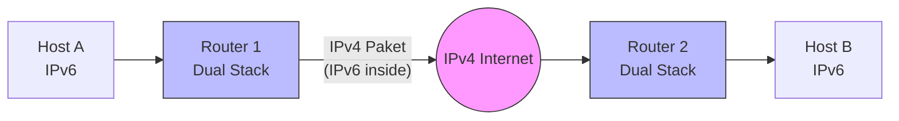

# 🌉 IPv6 Transition: Dual Stack & Tunnels

> [!abstract] Die 3 Strategien
> 1.  **Dual Stack:** (Empfohlen) IPv4 und IPv6 laufen gleichzeitig auf demselben Gerät.
> 2.  **Tunneling:** (Übergang) IPv6 Pakete werden in IPv4 Pakete verpackt (oder umgekehrt), um "Inseln" zu verbinden.
> 3.  **Translation:** (IPv6-Only) Protokoll-Übersetzung (NAT64), damit IPv6-Geräte mit IPv4-Servern reden können.

---

## 1. Dual Stack (Der Gold-Standard)

Hier haben Router und Clients **beide** Protokollstapel aktiviert.

* **Adressen:** Das Interface hat eine IPv4-Adresse (z.B. per DHCP) UND eine globale IPv6-Adresse (z.B. per SLAAC).
* **DNS:** Der DNS-Server gibt sowohl `A-Records` (IPv4) als auch `AAAA-Records` (IPv6) zurück.
* **Vorteil:** Native Performance, kein Overhead.
* **Nachteil:** Doppelte Konfiguration/Firewall-Regeln nötig. Adressmangel bei IPv4 bleibt bestehen.

> [!tip] Happy Eyeballs (RFC 8305)
> Moderne Browser/OS fragen DNS nach beiden Adressen. Sie bevorzugen IPv6 (`AAAA`). Wenn IPv6 zu langsam antwortet (z.B. < 300ms Unterschied), fallen sie blitzschnell auf IPv4 zurück. Das verhindert, dass kaputte IPv6-Verbindungen das Surfen verlangsamen.

---

## 2. Tunneling (Das "Kapseln")

Wenn zwei IPv6-Netzwerke über ein reines IPv4-Internet kommunizieren müssen, wird das IPv6-Paket in ein IPv4-Paket "eingepackt".

**Struktur des Pakets:**
`[ IPv4 Header | IPv6 Header | Nutzdaten ]`

> [!failure] MTU Problem (Klausurfalle!)
> Der zusätzliche IPv4-Header kostet 20 Bytes.
> * Ethernet MTU: 1500 Bytes.
> * Tunnel MTU: 1480 Bytes.
> * **Folge:** IPv6 Pakete müssen oft fragmentiert werden oder `MSS Clamping` ist nötig, sonst gehen große Pakete verloren ("Black Hole").

### Prinzip-Skizze (Mermaid)

---

## 3. Die Tunnel-Arten (Cheat Sheet)

Hier musst du oft unterscheiden, ob der Tunnel manuell oder automatisch ist.

| Tunnel-Art | Typ | Funktion & Merkmal |
| :--- | :--- | :--- |
| **Manual / GRE** | Statisch | **Punkt-zu-Punkt.** Administrator konfiguriert Quelle und Ziel fest. Stabil, aber nicht skalierbar. |
| **6to4** | Automatisch | Nutzt das Präfix **`2002::/16`**. Die IPv4-Adresse wird in die IPv6-Adresse eingebaut. Keine zentrale Infrastruktur nötig. |
| **ISATAP** | Automatisch | Für **Campus-Netze** (Intranets). Baut IPv4 in die Interface-ID ein. Präfix: `...0000:5EFE:IPv4`. |
| **Teredo** | Automatisch | "Die letzte Rettung". Funktioniert auch **hinter NAT** (verkapselt in UDP Port 3544). Windows hat das früher oft standardmäßig aktiviert. Präfix: `2001:0::/32`. |

---

## 4. 6to4 Adress-Berechnung (Beispiel)

Das kommt gerne in Prüfungen: "Bilden Sie die 6to4 Adresse für die öffentliche IPv4 `192.0.2.1`".

**Rezept:**
1. Präfix ist immer `2002`.
2. Wandle die 4 Oktette der IPv4-Adresse in Hex um.
3. Hänge sie an das Präfix an.

> [!example] Rechenweg
> **IPv4:** `192.0.2.1`
> * `192` = `C0`
> * `0` = `00`
> * `2` = `02`
> * `1` = `01`
>
> **Hex:** `C000:0201`
> **Ergebnis:** `2002:C000:0201::/48` (Der Rest ist für Subnetze).

---

## 5. Translation: NAT64 & DNS64

Wichtig für Mobilfunknetze (Smartphones haben oft nur noch IPv6), die aber alte IPv4-Webseiten erreichen müssen.

1.  **DNS64:** Client fragt nach `google.com` (nur IPv4 vorhanden). DNS64-Server "lügt" und generiert einen synthetischen `AAAA-Record` (IPv6), der auf den NAT64-Router zeigt.
2.  **NAT64:** Der Router empfängt das IPv6-Paket, entfernt den Header und baut einen IPv4-Header davor, um es zum Ziel zu schicken.

**Unterschied zu Tunneling:** Beim Tunneling bleibt das Originalpaket erhalten (verpackt). Bei Translation wird der Header **ausgetauscht**.

---

## 6. Zusammenfassung Tabelle

| Methode | Zielgruppe | Status |
| :--- | :--- | :--- |
| **Dual Stack** | Alle | **Standard**. Beste Performance. |
| **Manual Tunnel** | Site-to-Site VPN | Gut für feste Standortvernetzung. |
| **6to4 / ISATAP** | Frühe Migration | Veraltet (Deprecated), da unzuverlässig. |
| **NAT64/DNS64** | Mobile / ISP | Wichtig, um IPv4-Reste für IPv6-Clients erreichbar zu machen. |