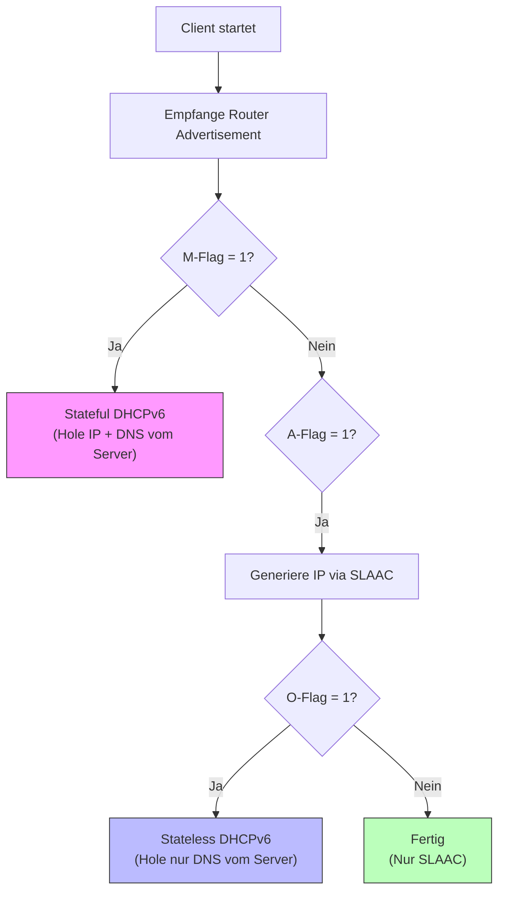

# ⚙️ IPv6 Adressvergabe: SLAAC & DHCPv6

> [!abstract] Überblick
> In IPv6 entscheidet der **Router** (via Router Advertisement), wie sich Clients konfigurieren sollen. Es gibt drei Hauptmethoden:
> 1. **SLAAC:** "Mach es dir selbst" (Automatisch, ohne Server).
> 2. **Stateless DHCPv6:** "IP machst du selbst, DNS gibts vom Server".
> 3. **Stateful DHCPv6:** "Alles vom Server" (Wie bei IPv4).

---

## 1. Die Entscheidung: RA Flags (Klausurrelevant!)

Der Client sendet eine **RS** (Router Solicitation). Der Router antwortet mit einem **RA** (Router Advertisement). In diesem RA-Paket stecken Flags, die den Modus bestimmen.

| Flag | Name | Bedeutung |
| :--- | :--- | :--- |
| **A-Flag** | Autonomous | `1` = Nutze das Präfix hier für **SLAAC**. |
| **M-Flag** | Managed | `1` = Nutze **Stateful DHCPv6** für die IP-Adresse. |
| **O-Flag** | Other | `1` = Nutze DHCPv6 nur für **andere Infos** (DNS, Domain), nicht für IP. |

**Kombinationen (Das musst du wissen):**

| Methode | A-Flag | M-Flag | O-Flag | Ergebnis |
| :--- | :--- | :--- | :--- | :--- |
| **SLAAC (Pur)** | **1** | 0 | 0 | Client generiert IP selbst. Kein DNS via DHCP.* |
| **SLAAC + Stateless DHCP**| **1** | 0 | **1** | IP via SLAAC, DNS via DHCPv6. |
| **Stateful DHCPv6** | 0 | **1** | (egal) | IP & DNS kommen vom DHCPv6 Server. |

*(Hinweis: Moderne Systeme können DNS auch via RA-Option RDNSS lernen, aber in klassischen Prüfungen wird oft die Trennung via DHCP verlangt).*

---

## 2. SLAAC (Stateless Address Autoconfiguration)

**Prinzip:** Plug & Play. Kein zentraler Server verwaltet die Adressen ("Stateless").

**Der Ablauf:**
1. **Router:** Sendet Präfix (64 Bit) im RA (A-Flag = 1).
2. **Client:** Nimmt das Präfix und baut sich die **Interface ID** (hintere 64 Bit) selbst.
3. **DAD:** Client prüft via *Neighbor Solicitation*, ob die Adresse schon belegt ist (Duplicate Address Detection).

**Wie baut der Client die Interface ID? (2 Methoden)**

### A. EUI-64 (Die "Hardware"-Methode)
Basiert auf der MAC-Adresse (48 Bit). Wird auf 64 Bit aufgeblasen.

> [!example] EUI-64 Berechnung (Klausur-Klassiker!)
> **MAC:** `00:11:22:33:44:55`
> 1. In der Mitte trennen: `0011:22` | `33:4455`
> 2. **`FF:FE`** einfügen: `0011:22`**`FF:FE`**`33:4455`
> 3. **7. Bit invertieren** (Universal/Local Bit):
>    * Erstes Byte `00` (hex) = `0000 0000` (binär).
>    * 7. Bit kippen -> `0000 0010` = `02` (hex).
> **Ergebnis:** `0211:22ff:fe33:4455`

### B. Privacy Extensions (Random)
Moderne Betriebssysteme (Windows 10/11, iOS, Android) nutzen **zufällige** Interface IDs, um Tracking zu verhindern. Die EUI-64 Methode wird oft als "Sicherheitsrisiko" betrachtet.

---

## 3. Stateless DHCPv6

Das "Beste aus beiden Welten".

* **Szenario:** Du willst die Last vom DHCP-Server nehmen (Router müssen keine Leases verwalten), willst den Clients aber einen spezifischen DNS-Server mitgeben.
* **Flags:** A=1 (Mach IP selbst), O=1 (Hol dir Infos), M=0.
* **Prozess:**
    1. Client baut IP via SLAAC.
    2. Client fragt DHCP-Server: "Gib mir DNS & Domain Name" (Information-Request).
    3. DHCP-Server vergibt **keine** IP-Adresse.

---

## 4. Stateful DHCPv6

Das klassische Modell (ähnlich IPv4).

* **Szenario:** Du willst volle Kontrolle, wer welche IP hat (z.B. für Logging/Audit) oder du willst IP-Bereiche fest zuweisen.
* **Flags:** M=1 (Geh zum DHCP), A=0 (Kein SLAAC nutzen).
* **Unterschied zu IPv4:**
    * Kein Broadcast! Client sendet an Multicast `ff02::1:2` (All-DHCP-Relay-Agents-and-Servers).
    * Der Router (Default Gateway) wird **trotzdem** per RA (Link-Local Adresse) gelernt, *nicht* per DHCP Option! DHCPv6 liefert meistens *kein* Default Gateway.

---

## 5. Vergleichstabelle (Spicker)

| Feature | SLAAC | Stateless DHCPv6 | Stateful DHCPv6 |
| :--- | :--- | :--- | :--- |
| **IP-Adresse** | Generiert Client (aus Präfix) | Generiert Client | **Vom Server** |
| **DNS-Server** | (Via RDNSS möglich) | **Vom Server** | **Vom Server** |
| **Default Gateway** | **Vom Router (RA)** | **Vom Router (RA)** | **Vom Router (RA)** |
| **Management** | Dezentral (wenig Last) | Mix | Zentral (hohe Kontrolle) |
| **Tracking** | Schwierig (Privacy Ext.) | Mittel | Einfach (Lease Table) |
| **Kritische Flags** | A=1, M=0, O=0 | A=1, M=0, O=1 | A=0, M=1 |

---
## 6. Entscheidungsprozess (Mermaid)

