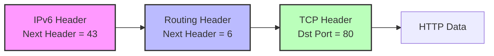

# 📑 IPv6 Header - Prüfungsvorbereitung (Spicker)

> [!abstract] Schnell-Fakten (Top-Level)
> * **Header-Länge:** Fix **40 Bytes** (kein IHL-Feld mehr nötig).
> * **Adressen:** 128 Bit (Hexadezimal dargestellt).
> * **Checksum:** **Gibt es nicht mehr!** (Macht jetzt Layer 2 & 4).
> * **Fragmentierung:** Nur noch durch den **Sender**, nicht durch Router!

---

## 1. Der Header-Aufbau (Visualisierung)

Der Header ist 320 Bits (40 Bytes) lang.

| Bit 0-3 | Bit 4-11 | Bit 12-31 |
| :--- | :--- | :--- |
| **Version** (4) | **Traffic Class** (8) | **Flow Label** (20) |
| **Payload Length** (16) | **Next Header** (8) | **Hop Limit** (8) |
| **Source Address** (128 Bit) | ... | ... |
| ... | ... | ... |
| ... | ... | ... |
| ... | ... | ... |
| **Destination Address** (128 Bit) | ... | ... |
| ... | ... | ... |
| ... | ... | ... |
| ... | ... | ... |

---

## 2. Felder im Detail (Cheat Sheet)

| Feld | Bits | Erklärung & Funktion | 🎓 Klausur-Wissen |
| :--- | :--- | :--- | :--- |
| **Version** | 4 | Identifiziert IP-Version. Wert ist immer `6` (`0110`). | Identisch zur Position in IPv4. |
| **Traffic Class** | 8 | Priorisierung (QoS). Unterteilt in DSCP (6 Bit) und ECN (2 Bit). | Früher "Type of Service" (ToS). |
| **Flow Label** | 20 | Kennzeichnet zusammengehörige Pakete (z.B. Video-Stream) für schnelleres Routing/Caching. | **Neu!** Gab es in IPv4 nicht. |
| **Payload Length** | 16 | Länge der Nutzdaten in Bytes. | **Achtung:** Beinhaltet Extension Headers + Layer 4 Daten! |
| **Next Header** | 8 | Gibt an, welches Protokoll folgt (TCP, UDP oder Extension). | Ersetzt das "Protocol"-Feld aus IPv4. |
| **Hop Limit** | 8 | Lebensdauer. Router zählen -1. Bei 0 = Drop. | Ersetzt "TTL" (Time to Live). |
| **Source / Dest** | 128 | Die IP-Adressen. | 4x größer als IPv4 (32 vs 128 Bit). |

---

## 3. Das "Daisy Chain" Prinzip (Next Header)

IPv6 nutzt **Extension Headers** statt Optionen im Haupt-Header. Das Feld `Next Header` zeigt immer auf das nächste Element.

> [!TIP] Wichtige "Next Header" Werte für die Prüfung
> * **6** = TCP
> * **17** = UDP
> * **58** = ICMPv6 (Achtung: Nicht 1 wie bei IPv4!)
> * **0** = Hop-by-Hop Option (Muss jeder Router lesen)
> * **43** = Routing Header
> * **44** = Fragment Header
> * **59** = No Next Header (Ende)

---

## 4. Praxis-Beispiel: Hex-Dump Analyse

Stell dir vor, diese Bytes liegen in der Prüfung vor:

`60 00 00 00 00 24 06 40 ...`

> [!example] Schritt-für-Schritt Analyse
> 1. **`6`** (Nibble 1) -> **Version 6**.
> 2. **`0 00`** -> **Traffic Class** 0.
> 3. **`0 00 00`** -> **Flow Label** 0.
> 4. **`00 24`** -> **Payload Length**.
>    * Hex `0x24` in Dezimal = $2 \cdot 16 + 4 = 36$.
>    * Das Paket hat **36 Bytes** Daten.
> 5. **`06`** -> **Next Header**.
>    * Wert 6 steht für **TCP**.
> 6. **`40`** -> **Hop Limit**.
>    * Hex `0x40` in Dezimal = $4 \cdot 16 = 64$.
>    * Das Paket darf **64 Hops** springen.

---

## 5. IPv4 vs. IPv6 (Unterschiede)

> [!failure] Was wurde entfernt?
> * **Header Checksum:** Router rechnen nicht mehr (schneller). Fehlererkennung macht Layer 2 (CRC) und Layer 4 (TCP Checksum).
> * **Fragmentation Fields:** Router fragmentieren nicht mehr. Wenn Paket > MTU, wird es verworfen & ICMPv6 "Packet Too Big" gesendet.
> * **Header Length (IHL):** Nicht nötig, da fix 40 Bytes.

> [!success] Was ist neu?
> * **Flow Label:** Für Echtzeit-Anwendungen.
> * **Fixe Länge:** Einfachere Hardware-Verarbeitung.
> * **Extension Headers:** Flexibel erweiterbar ohne den Basis-Header aufzublähen.
