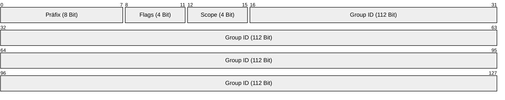

# 📡 IPv6 Multicast - Prüfungsvorbereitung (Spicker)

> [!abstract] Das Wichtigste vorab
> * **Kein Broadcast mehr!** IPv6 nutzt Multicast für alles, was früher Broadcast war (z.B. ARP gibt es nicht mehr, dafür NDP via Multicast).
> * **Präfix:** Immer `ff00::/8` (Die ersten 8 Bits sind `1111 1111`).
> * **Funktion:** One-to-Many (Ein Sender an eine definierte Gruppe von Empfängern).

---

## 1. Aufbau der Multicast-Adresse

Eine IPv6 Multicast-Adresse besteht aus 128 Bit, aber die Struktur ist strikt unterteilt.

*(Falls Mermaid in deiner Obsidian-Version nicht so aussieht, hier die Tabelle:)*

| Bits | Feld | Wert / Bedeutung |
| :--- | :--- | :--- |
| **0-7** | **Präfix** | Immer `1111 1111` (Hex `ff`). |
| **8-11** | **Flags** | Status der Adresse (z.B. permanent oder temporär). |
| **12-15** | **Scope** | Gültigkeitsbereich (wie weit darf das Paket reisen?). |
| **16-127**| **Group ID** | Identifiziert die Multicast-Gruppe. |

---

## 2. Die Flags (4 Bit)

Die Flags liegen an der 3. Stelle der Hex-Notation (`ff0`**`X`**`::`).
Struktur: `0 R P T`

| Flag | Name | Bedeutung für die Prüfung |
| :--- | :--- | :--- |
| **0** | Reserviert | Muss 0 sein. |
| **R** | Rendezvous | Für RP (Rendezvous Point) Embedding (meist 0). |
| **P** | Prefix | Adress-basiertes Multicast (meist 0). |
| **T** | **Transient** | **Wichtigstes Flag!**   `0` = Well-known (Permanent, von IANA vergeben).   `1` = Transient (Temporär/Dynamisch). |

> [!example] Beispiel
> * `ff02::1` -> Flag ist **0** -> Well-known Adresse (All Nodes).
> * `ff12::1` -> Flag ist **1** -> Temporäre Gruppe.

---

## 3. Der Scope (4 Bit) - Klausurrelevant!

Der Scope definiert, wie weit das Paket geroutet wird. Er steht an der 4. Stelle (`ff0`**`X`**`::`).

| Wert (Hex) | Name | Reichweite |
| :--- | :--- | :--- |
| **1** | **Interface-Local** | Verlässt das Loopback-Interface nicht (intern). |
| **2** | **Link-Local** | **Am wichtigsten!** Nur im eigenen LAN (wird nicht geroutet). |
| **4** | Admin-Local | Administrativ definierter Bereich. |
| **5** | **Site-Local** | Innerhalb des Standorts (veraltet, aber oft noch abgefragt). |
| **8** | Organization-Local | Innerhalb der Firma/Organisation. |
| **E** | Global | Weltweit (Internet). |

> [!tip] Merkhilfe
> * **2** wie "Zwei Geräte im selben Kabel" -> **Link-Local**.
> * **E** wie "Earth" -> **Global**.

---

## 4. Wichtige Well-Known Adressen

Diese Adressen musst du oft auswendig können (meist Scope 2 = Link-Local).

| Adresse | Name | Entsprechung IPv4 |
| :--- | :--- | :--- |
| **`ff02::1`** | **All Nodes** | Broadcast (`255.255.255.255`) - erreicht alle IPv6-Geräte im LAN. |
| **`ff02::2`** | **All Routers** | Erreicht alle Router im LAN. |
| **`ff02::1:2`**| DHCPv6 Relay/Server| Um einen DHCP-Server zu finden. |
| **`ff02::5`** | OSPFv3 | OSPF Router. |
| **`ff02::a`** | EIGRP | EIGRP Router. |
| **`ff02::1:ffxx:xxxx`** | **Solicited-Node** | Speziell für Neighbor Discovery (siehe unten). |

---

## 5. Solicited-Node Multicast Address (SNMA)

Dies ist der Ersatz für ARP-Requests. Jedes Gerät tritt automatisch einer SNMA-Gruppe bei für jede seiner Unicast-Adressen.

**Bauplan:**
Prefix `ff02::1:ff` + **die letzten 24 Bit** der Unicast-Adresse.

> [!example] Rechenbeispiel
> * **Unicast IP:** `2001:db8::1234:5678`
> * **Letzte 24 Bit:** `34:5678`
> * **SNMA:** `ff02::1:ff34:5678`
> * **Zweck:** Wird genutzt für **DAD** (Duplicate Address Detection) und Adressauflösung (NDP).

---

## 6. Layer 2 Mapping (Ethernet MAC)

Wenn ein IPv6 Multicast-Paket über Ethernet gesendet wird, muss die Ziel-MAC-Adresse eine Multicast-MAC sein.

**Regel:**
MAC-Präfix `33:33` + **die letzten 32 Bit** der IPv6 Multicast-Adresse.

> [!info] Beispiel Mapping
> * **IPv6 Multicast Ziel:** `ff02::1` (All Nodes)
> * **Letzte 32 Bit:** `00:00:00:01`
> * **Resultierende MAC:** `33:33:00:00:00:01`

---

## 7. MLD (Multicast Listener Discovery)

Da es kein IGMP (wie bei IPv4) mehr gibt, nutzt IPv6 **MLD**.
* **MLD** ist Teil von ICMPv6.
* Dient dazu, dass Router wissen, welche Multicast-Gruppen im LAN benötigt werden (damit Switches den Traffic nicht fluten -> "MLD Snooping").