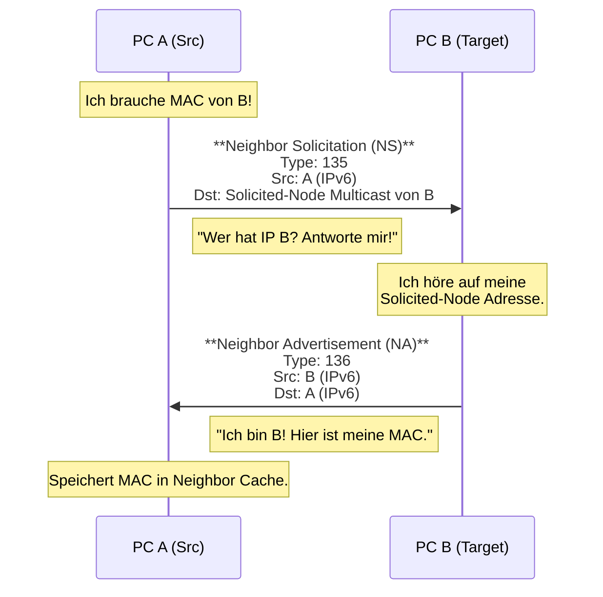

# 📨 IPv6 Protokolle & ICMPv6 Deep Dive

> [!abstract] Warum ICMPv6 so wichtig ist
> In IPv4 war ICMP "nur" für Ping und Fehlermeldungen da.
> In IPv6 übernimmt **ICMPv6 (Protocol 58)** folgende Aufgaben:
> * **Fehlermeldungen** (wie früher).
> * **Adressauflösung** (ersetzt ARP!).
> * **Gruppenmanagement** (ersetzt IGMP).
> * **Adressvergabe** (SLAAC).
> * **Path MTU Discovery**.

---

## 1. Der ICMPv6 Header

Der Header ist simpel, sitzt direkt hinter dem IPv6 Header (oder Extension Header).

**Next Header Wert im IPv6-Header:** `58`

| Bit 0-7 | Bit 8-15 | Bit 16-31 |
| :--- | :--- | :--- |
| **Type** (8 Bit) | **Code** (8 Bit) | **Checksum** (16 Bit) |
| **Message Body** | (variabel, je nach Typ) | ... |

* **Type:** Welche Kategorie (Fehler oder Info)?
* **Code:** Genauere Spezifizierung des Typs.
* **Checksum:** Prüft Header UND Daten UND einen Teil des IPv6 Headers (Pseudo-Header).

---

## 2. ICMPv6 Message Types (Klausur-Tabelle)

Die Typen sind in zwei Bereiche geteilt.

### A. Fehlermeldungen (Type 0 - 127)
Wenn ein Paket nicht zugestellt werden kann, **MUSS** das High-Order Bit 0 sein.

| Type | Name | Wofür? | Code Beispiele |
| :--- | :--- | :--- | :--- |
| **1** | **Destination Unreachable** | Paket kam nicht an. | `0`=No Route, `3`=Address Unreachable, `4`=Port Unreachable. |
| **2** | **Packet Too Big** | **Kritisch!** Ersetzt Fragmentierung. | Enthält die **MTU** des Hops, der das Paket verworfen hat. Nötig für PMTUD. |
| **3** | **Time Exceeded** | Hop Limit abgelaufen. | `0`=Hop Limit 0 (Loop prevention), `1`=Fragment reassembly time exceeded. |
| **4** | **Parameter Problem** | Syntaxfehler im Header. | Zeigt auf das falsche Byte im IPv6 Header. |

### B. Informationsnachrichten (Type 128 - 255)

| Type | Name | Funktion |
| :--- | :--- | :--- |
| **128** | **Echo Request** | Der klassische "Ping". |
| **129** | **Echo Reply** | Die Antwort auf den Ping. |
| **133** | **Router Solicitation (RS)** | Client: "Hallo? Gibt es hier Router?" |
| **134** | **Router Advertisement (RA)** | Router: "Ja, hier bin ich. Hier ist dein Präfix." |
| **135** | **Neighbor Solicitation (NS)** | Ersatz für ARP Request. "Wer hat IP X?" |
| **136** | **Neighbor Advertisement (NA)** | Ersatz für ARP Reply. "Ich habe IP X, hier ist meine MAC." |

---

## 3. NDP (Neighbor Discovery Protocol)

NDP (RFC 4861) nutzt ICMPv6 Nachrichten (133-137). Es arbeitet auf Layer 3, nutzt aber Multicast, um Layer 2 Infos zu bekommen.

### Der Prozess: Adressauflösung (Ersatz für ARP)
Szenario: PC A will PC B pingen. Er kennt die IPv6 von B, braucht aber die MAC.

### Die Neighbor States (Zustandsautomat)
Ein Eintrag im Neighbor Cache (ähnlich ARP-Tabelle) hat einen Status. Das wird in Prüfungen gern gefragt.

1.  **INCOMPLETE:** NS gesendet, warte auf Antwort.
2.  **REACHABLE:** Antwort (NA) erhalten, Pfad funktioniert. (Standard: 30 Sek).
3.  **STALE:** Zeit abgelaufen. Eintrag noch da, aber unbestätigt. Wird benutzt, aber beim Senden wird Status auf DELAY gesetzt.
4.  **DELAY:** Wartezeit (5 Sek), falls Upper-Layer (TCP) den Kontakt nicht bestätigt.
5.  **PROBE:** Sende Unicast NS, um zu prüfen, ob der Nachbar noch da ist. -> Zurück zu REACHABLE oder löschen.

---

## 4. Duplicate Address Detection (DAD)

Bevor ein Gerät eine IP benutzt, **muss** es prüfen, ob sie frei ist.

1.  Gerät baut sich eine "Tentative Address" (vorläufig).
2.  Gerät sendet **Neighbor Solicitation (NS)**.
    * **Source:** `::` (Unspecified Address) -> Wichtig! Daran erkennt man DAD.
    * **Destination:** Solicited-Node Multicast der Wunsch-Adresse.
3.  **Szenario A:** Niemand antwortet (Timeout). -> Adresse ist frei.
4.  **Szenario B:** Jemand sendet **NA** zurück. -> Adresse belegt. Interface wird deaktiviert.

---

## 5. TCP/UDP Checksummen (Layer 4 Pseudo-Header)

In IPv4 war die Header Checksum im IP-Header. In IPv6 gibt es die nicht mehr.
**Konsequenz:** Die Checksumme in TCP und UDP (Layer 4) ist nun **verpflichtend** (in IPv4 UDP war sie optional).

Damit Layer 4 sicherstellt, dass das Paket am richtigen Ziel ankam, wird ein **Pseudo-Header** in die Checksummen-Berechnung einbezogen.

**Der IPv6 Pseudo-Header:**

| Feld | Größe |
| :--- | :--- |
| **Source Address** | 128 Bit |
| **Destination Address** | 128 Bit |
| **Upper Layer Length** | 32 Bit (Länge von TCP/UDP Header + Data) |
| **Zero** | 24 Bit (Padding) |
| **Next Header** | 8 Bit (z.B. 6 für TCP, 17 für UDP) |

> [!failure] Klausurfalle
> Wenn ein Router NAT64 macht oder die IP-Adresse ändert, **muss** er auch die TCP/UDP-Checksumme neu berechnen, obwohl er eigentlich Layer 4 nicht anfasst! Warum? Weil die IP-Adressen Teil der Layer-4-Prüfsumme (via Pseudo-Header) sind.

---

## 6. Path MTU Discovery (PMTUD)

Da Router nicht fragmentieren, muss der Sender die richtige Paketgröße wissen.

1.  Sender schickt großes Paket (z.B. 1500 Byte).
2.  Router auf dem Weg hat nur 1400 Byte MTU.
3.  Router verwirft Paket und sendet **ICMPv6 Type 2 (Packet Too Big)** zurück.
    * Im ICMP-Body steht: "MTU = 1400".
4.  Sender passt seine Paketgröße an und sendet neu.