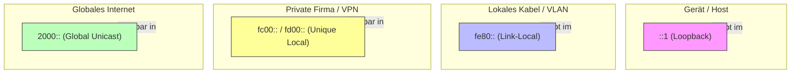

# 🏷️ IPv6 Adresstypen & Wichtige Präfixe

> [!abstract] Grundwissen
> * **Länge:** 128 Bit (32 Hex-Ziffern).
> * **Gruppen:** 8 Blöcke à 16 Bit (getrennt durch Doppelpunkt `: `).
> * **Broadcast:** Gibt es nicht mehr! (Ersetzt durch Multicast).

---

## 1. Schreibweise & Kürzung (Klausur-Regeln)

In Prüfungen musst du oft Adressen kürzen oder expandieren.

1.  **Leading Zeros:** Führende Nullen im Block dürfen wegfallen.
    * `0021` -> `21`
    * `0000` -> `0`
2.  **Double Colon (::):** Einmalig pro Adresse dürfen aufeinanderfolgende Null-Blöcke durch `::` ersetzt werden.
    * `2001:0:0:0:1::1` -> Richtig.
    * `2001::1::2` -> **Falsch!** (Router wüsste nicht, wo wie viele Nullen fehlen).

> [!example] Beispiel
> **Lang:** `2001:0db8:0000:0000:0000:0000:0000:0001`
> **Gekürzt:** `2001:db8::1`

---

## 2. Die wichtigsten Präfixe (Cheat Sheet)

Diese Tabelle musst du auswendig können.

| Präfix | Typ | Name | IPv4 Vergleich | Erklärung |
| :--- | :--- | :--- | :--- | :--- |
| **`::/128`** | Special | **Unspecified** | `0.0.0.0` | "Ich habe noch keine Adresse" (z.B. bei DHCP-Anfrage). Darf nie Ziel sein. |
| **`::1/128`** | Special | **Loopback** | `127.0.0.1` | Localhost. Verlässt niemals das Gerät. |
| **`2000::/3`** | Unicast | **Global Unicast (GUA)** | Public IP | Öffentlich routbare Adressen im Internet. (Bereich 2000... bis 3fff...). |
| **`fe80::/10`** | Unicast | **Link-Local (LLA)** | `169.254.x.x` | **Pflicht!** Jedes Interface hat eine. Wird **nicht** geroutet. Nur im eigenen LAN Segment. |
| **`fc00::/7`** | Unicast | **Unique Local (ULA)** | `192.168.x.x` | Private Adressen. Werden im Internet nicht geroutet. (Meistens Start mit `fd...`). |
| **`ff00::/8`** | Multicast| **Multicast** | `224.0.0.0` | "Einer an viele". Ersetzt Broadcast. |
| **`2001:db8::/32`**| Unicast | **Documentation** | `192.0.2.x` | Nur für Lehrbücher/Doku. Wird niemals im Internet geroutet. |

---

## 3. Adresstypen im Detail

### A. Global Unicast (GUA) - `2000::/3`
Der Standard für Internet-Traffic.
* **Struktur:**
    `[ Global Routing Prefix (48) | Subnet ID (16) | Interface ID (64) ]`
* Vom Provider bekommst du meist ein `/48` oder `/56` Netz.

### B. Link-Local (LLA) - `fe80::/10`
Die wichtigste Adresse für das interne "Gespräch" der Geräte.
* **Wann?** Sobald IPv6 aktiviert ist, generiert sich das Gerät selbst eine `fe80::...`.
* **Wofür?** Routing-Protokolle (OSPFv3), Neighbor Discovery (NDP), DHCPv6 Kommunikation.
* **Besonderheit:** Da `fe80::1` auf *jedem* Interface existieren könnte, muss man bei Pings immer das Interface angeben (Zone ID).
    * Beispiel: `ping fe80::1%eth0`

### C. Unique Local (ULA) - `fc00::/7`
Der Ersatz für private IPv4 (RFC 1918).
* Beginnen in der Praxis fast immer mit **`fd`** (da das 8. Bit auf 1 gesetzt wird für "Locally assigned").
* Man sollte 40 Bit zufällig generieren ("Global ID"), um Kollisionen bei VPN-Verbindungen zu vermeiden.
* `[ Prefix fd (8) | Global ID (40) | Subnet (16) | Interface ID (64) ]`

### D. Anycast
* **Kein eigener Adressbereich!**
* Es ist eine normale Unicast-Adresse, die aber *mehreren* Geräten zugewiesen wird.
* Routing: "Schick das Paket zum **nächstgelegenen** (topologisch) Gerät mit dieser IP".
* Einsatz: Root-DNS-Server, CDN.

---

## 4. Visualisierung der Scopes

Wie weit darf ein Paket mit dieser Adresse reisen?

---

## 5. Übergangs-Adressen (Transition)

Diese tauchen manchmal in Prüfungen auf, wenn es um Dual Stack geht.

| Präfix | Name | Format |
| :--- | :--- | :--- |
| **`::ffff:0:0/96`** | **IPv4-mapped** | `::ffff:192.168.1.1` | Wird intern vom Betriebssystem genutzt, um IPv4 Pakete über die IPv6 Socket-API abzubilden. |
| **`2002::/16`** | **6to4 Tunnel** | `2002:c000:0201::` | Enthält die hexadezimale IPv4 Adresse des Routers. |
| **`2001:0::/32`** | **Teredo** | - | Alter Tunnel-Mechanismus (Windows XP/7 Zeit). |

> [!warning] Veraltet
> **IPv4-compatible** (`::192.168.1.1` bzw. 96 Null-Bits) ist veraltet (Deprecated). Nicht mit *IPv4-mapped* verwechseln!

